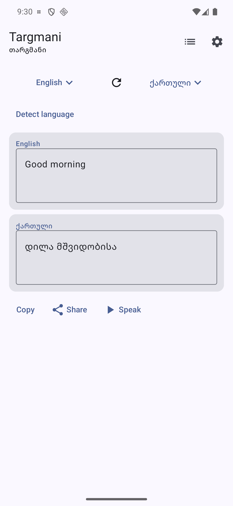
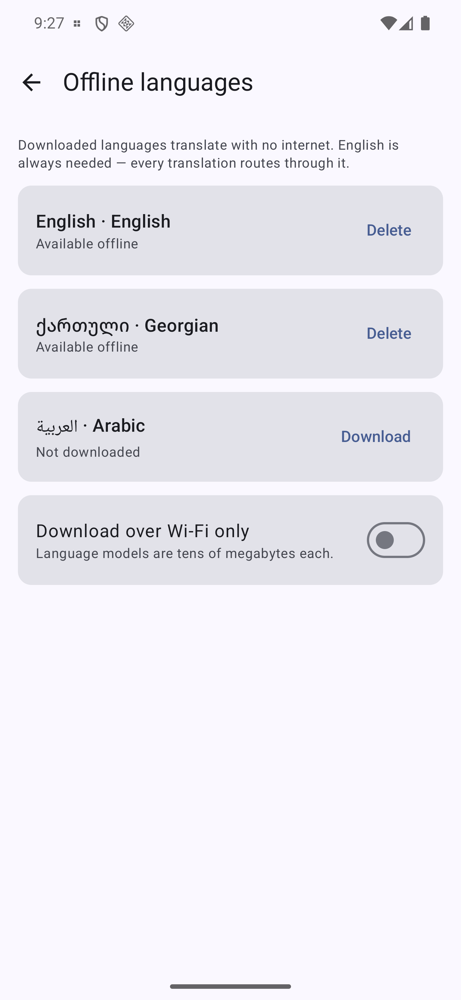
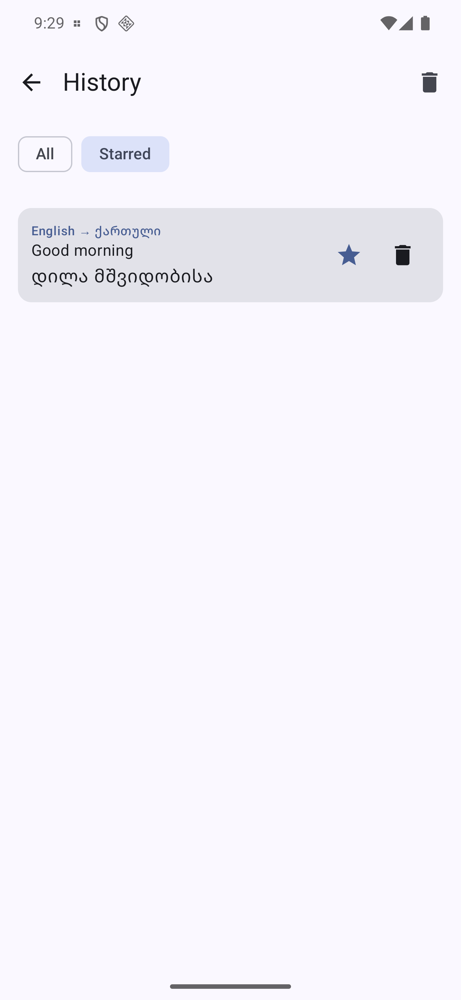
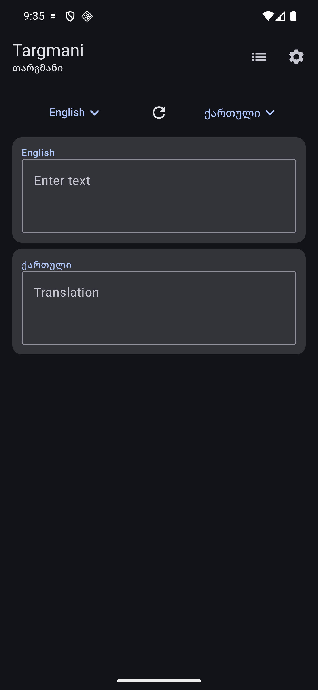

# Targmani 🗣

[](https://github.com/Meko123456/Targmani/actions/workflows/ci.yml)
[](LICENSE)

**თარგმანი** (*targmani* — Georgian for "translation") — a small, **offline** translator for the
three languages I actually live in: **Georgian ↔ English ↔ Arabic**. Every translation runs
**on-device** with Google's ML Kit; the network is used only to download each language model
once, and never for the translations themselves.

No accounts, no server, no analytics. After the one-time model download, it works on a plane.

## Why this app exists

Generic translators are online-first, ad-heavy, and rarely handle Georgian well. I move between
Tbilisi (Georgian), an English working life, and Arabic around Dubai — and I want a translator
that: works with no signal, keeps my text on the device, and treats Georgian as a first-class
language, not an afterthought. ML Kit has on-device models for all three, so this is buildable
as a genuinely offline tool.

## Screenshots

| Translate | Offline languages | History | Dark |
|:---:|:---:|:---:|:---:|
|  |  |  |  |

## Features

- 🔤 **Text translation** — type in one language, get the other, on-device. Georgian, English
  and Arabic, any pairing, translated live as you type (400 ms debounce, in-flight work cancelled
  on each keystroke).
- 🔁 **One-tap language swap** — swaps the text too, so a reply is one tap away.
- 📥 **Model manager** — download / delete each language model and see what is ready offline,
  with a Wi-Fi-only option so it never eats mobile data. Because ML Kit pivots every translation
  through English, the screen explains why a Georgian↔Arabic pair still needs the English model,
  and warns before you delete it.
- 🧠 **Auto-detect source** (ML Kit language identification) — paste and go. A language Targmani
  doesn't offer leaves your direction untouched rather than guessing.
- 🕘 **History & favourites** — every translation is saved on-device: star the ones worth keeping,
  tap any entry to load it straight back into the editor, filter to just the starred, and clear
  the rest (starred survive). Because translation runs as you type, a run of half-typed fragments
  collapses into a single entry instead of flooding the list.
- 📋 **Copy, share and speak** the result. Speaking is best-effort: Georgian is not in the standard
  Android voice set, so a missing voice is reported plainly instead of failing silently.
- 🅰️ **Right-to-left aware** — Arabic input and output lay out correctly.
- ♿ **Accessible** — every interactive control carries a label; audited across all three screens
  (translate, offline languages, history) with zero unlabelled controls.
- 🔒 **Private & offline** — your text never leaves the device; only model files are downloaded.
- 📷 **Camera translate** — deferred, and honestly so: ML Kit's text recogniser reads only Latin,
  Chinese, Devanagari, Japanese and Korean script, so it cannot read a Georgian or Arabic sign —
  exactly the two cases that would be useful here. Tracked in
  [#11](https://github.com/Meko123456/Targmani/issues/11) with the options.
- 🎨 **Material 3** — dynamic color, light/dark, edge-to-edge.

## Architecture

```
domain/    pure Kotlin, 53 unit tests — Language (BCP-47 + endonyms + RTL), LanguageCatalog
           (offered languages, direction & model-pair math), TranslationDirection (+ swap),
           ModelPlanner (what a direction still needs, English-pivot rules), HistoryPolicy
           (what is worth recording), DetectionMapper, SettingsCodec, SpeechLocale, and the
           Translator / LanguageDetector / ModelStore ports so view models test against fakes
data/      Room (translation history) + DataStore preferences (last direction, Wi-Fi-only)
translate/ ML Kit implementations: translation, language identification, model storage
speech/    platform text-to-speech, with missing-voice handled as a normal outcome
ui/        Compose — translate screen, model manager, history
```

The `domain/` layer never imports ML Kit — it holds only plain Kotlin (language codes,
direction math, the `Translator` interface), so the logic is fully unit-testable and the
ML Kit dependency lives behind one seam.

## Building

```
./gradlew :app:assembleDebug :app:testDebugUnitTest
```

Kotlin 2.3, AGP 9, Compose BOM 2026.06, minSdk 26, ML Kit Translate 17, Room 2.8.

Verified on a real device: "Good morning friend" → "დილა მშვიდობისა" in about six seconds
including the one-time model download, and the swap translates it straight back.

## License

[MIT](LICENSE) © 2026 Merab Kochlamazashvili
